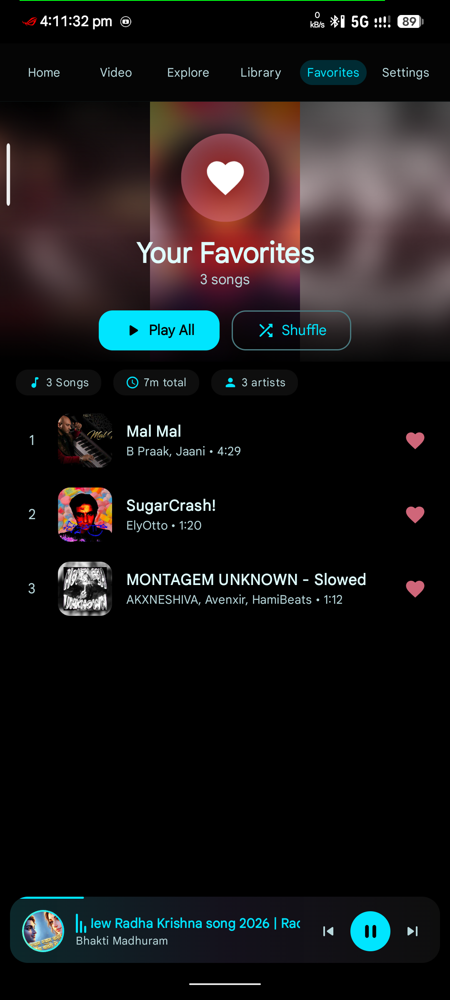
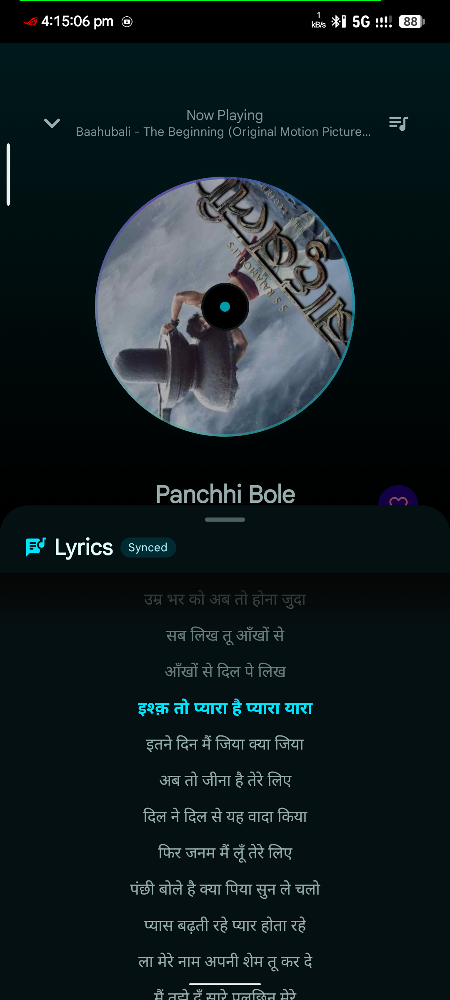

"<p align="center">
  
</p>

<p align="center">
  
  
  
  
  
  
  
</p>

<p align="center">
  
  
  
  
  
</p>

---

## ✨ Features

<table>
<tr>
<td width="50%">

### 🎵 Playback
- **ExoPlayer/Media3** high-quality audio engine
- Play, pause, skip, seek, shuffle & repeat modes
- **Crossfade** transitions between tracks
- **Sleep timer** with countdown display
- **5-band Equalizer** with presets
- Audio focus & gapless playback
- Background playback via **foreground service**
- Media notification with Bluetooth support

</td>
<td width="50%">

### 🎨 User Interface
- **Material 3** with dynamic color (Android 12+)
- **7 theme modes**: System, Light, Dark, AMOLED Purple/Cyan/Pink/Gold
- **Neumorphic** UI elements & shadows
- **Horizontal pager** tab navigation
- **Mini-player** with animated artwork
- Edge-to-edge immersive display
- Splash screen API
- Animated transitions throughout

</td>
</tr>
<tr>
<td width="50%">

### 📚 Library
- Automatic **MediaStore** scanning
- 30-second minimum track filter
- **Albums**, **Artists**, **Playlists** views
- **Favorites** system
- **Recently played** history
- **Most played** tracking
- Playlist CRUD management
- Search with 300ms debounce

</td>
<td width="50%">

### 🎬 Video Player
- Full ExoPlayer video playback
- **Picture-in-Picture** (PiP) mode
- Gesture controls: brightness, seek, volume
- Speed control (0.25x – 2x)
- Scale modes (fit/crop/fill)
- Subtitle track switching
- Volume boost beyond 100%
- Background audio mode

</td>
</tr>
</table>

---

## 📸 Screenshots

<table>
<tr>
  <td align="center"></td>
  <td align="center"></td>
</tr>
<tr>
  <td align="center"></td>
  <td align="center"></td>
</tr>
<tr>
  <td align="center"></td>
  <td align="center"></td>
</tr>
<tr>
  <td align="center" colspan="2"></td>
</tr>
</table>

---

## 🛠 Tech Stack

<p align="center">
  
  
  
  
  
  
</p>

| Layer | Technology |
|---|---|
| **UI** | Jetpack Compose, Material 3, Compose Navigation |
| **Architecture** | MVVM + Repository Pattern |
| **DI** | Hilt (Dagger) with KSP |
| **Database** | Room (SQLite) with KSP |
| **Media** | AndroidX Media3 / ExoPlayer (DASH, HLS) |
| **Images** | Coil (Compose + Video decoder) |
| **Preferences** | DataStore Preferences |
| **Background** | Foreground Service + MediaSessionService |
| **Async** | Kotlin Coroutines & Flow |
| **Build** | Gradle, AGP 8.5.0, Kotlin 1.9.24 |

---

## 🏗 Architecture

```
MediaStore ──▶ MusicScanner ──▶ Room DB ──▶ Repository ──▶ ViewModel ──▶ Compose UI
                    │                           │
                    │                    PlayerViewModel
                    │                           │
                    └────── ExoPlayer ◀── MediaController ◀── MusicService
```

### Project Structure

```
ABMusic/
├── app/
│   ├── src/main/
│   │   ├── AndroidManifest.xml
│   │   └── kotlin/com/io/ab/music/
│   │       ├── ABMusicApp.kt              # @HiltAndroidApp, Coil decoder registration
│   │       ├── MainActivity.kt           # Single activity, theme + navigation
│   │       ├── di/DatabaseModule.kt      # Hilt Room provider
│   │       ├── data/
│   │       │   ├── db/                   # Room: entities, DAOs, MusicDatabase
│   │       │   ├── scanner/              # MusicScanner, VideoScanner
│   │       │   ├── repository/           # MusicRepository
│   │       │   └── preferences/          # DataStore UserPreferences
│   │       ├── domain/model/             # Song, Album, Artist, Playlist, Video
│   │       ├── service/
│   │       │   ├── MusicService.kt       # Media3 foreground service
│   │       │   └── NotificationCloseReceiver.kt
│   │       ├── ui/
│   │       │   ├── components/           # SongItem, MiniPlayer, ArtworkModel
│   │       │   ├── navigation/           # Screen routes, NavGraph
│   │       │   ├── theme/                # Color, Theme, Typography, Neumorphism
│   │       │   ├── viewmodel/            # PlayerVM, LibraryVM, SettingsVM, VideoVM
│   │       │   └── screens/              # All screens (10+ screens)
│   │       └── utils/Extensions.kt
│   ├── build.gradle
│   └── proguard-rules.pro
├── gradle/libs.versions.toml             # Version catalog
├── settings.gradle
├── gradle.properties
└── update.json                           # OTA update manifest
```

---

## 📋 Requirements

| Requirement | Version |
|---|---|
| **Android Studio** | Hedgehog or later |
| **JDK** | 17+ |
| **Gradle** | 8.x |
| **Min SDK** | 26 (Android 8.0) |
| **Target SDK** | 36 (Android 15) |
| **Compile SDK** | 36 |

---

## 🚀 Build

```bash
# Debug build
./gradlew assembleDebug

# Release build (requires keystore)
./gradlew assembleRelease

# Install on device
./gradlew installDebug
```

> Debug APK gets `.debug` suffix in application ID and version name.

---

## 📱 Permissions

| Permission | Required For |
|---|---|
| `READ_MEDIA_AUDIO` (13+) | Access audio files |
| `READ_MEDIA_VIDEO` (13+) | Access video files |
| `READ_EXTERNAL_STORAGE` (≤12) | Legacy storage access |
| `POST_NOTIFICATIONS` | Media playback notification |
| `FOREGROUND_SERVICE` | Background playback |
| `BLUETOOTH_CONNECT` | Bluetooth device controls |
| `MODIFY_AUDIO_SETTINGS` | Equalizer |
| `INTERNET` | OTA updates |

---

## 🎯 Roadmap

- [x] Audio playback with ExoPlayer/Media3
- [x] Background service & notification
- [x] Playlist management
- [x] Favorites system
- [x] Equalizer
- [x] Sleep timer
- [x] Video player with PiP
- [x] AMOLED themes
- [x] OTA updates
- [ ] Android Auto support
- [ ] Lyrics display
- [ ] Tag editing
- [ ] Folder browsing

---

## 📄 License

```
Copyright 2024 Sandeep Bedia

Licensed under the Apache License, Version 2.0 (the "License");
you may not use this file except in compliance with the License.
You may obtain a copy of the License at

    http://www.apache.org/licenses/LICENSE-2.0

Unless required by applicable law or agreed to in writing, software
distributed under the License is distributed on an "AS IS" BASIS,
WITHOUT WARRANTIES OR CONDITIONS OF ANY KIND, either express or implied.
See the License for the specific language governing permissions and
limitations under the License.
```

---

<p align="center">
  <sub>Built with ❤️ using Jetpack Compose & Material 3</sub>
  <br>
  <sub>© 2024 Sandeep Bedia</sub>
</p>

<p align="center">
  <a href="https://github.com/Sandeepbedia/AB-Music/releases">
    
  </a>
</p>
