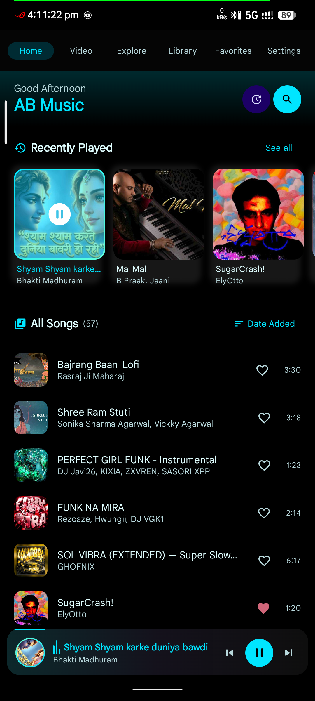
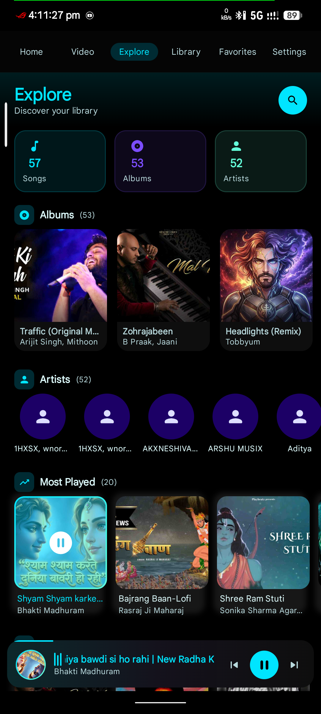
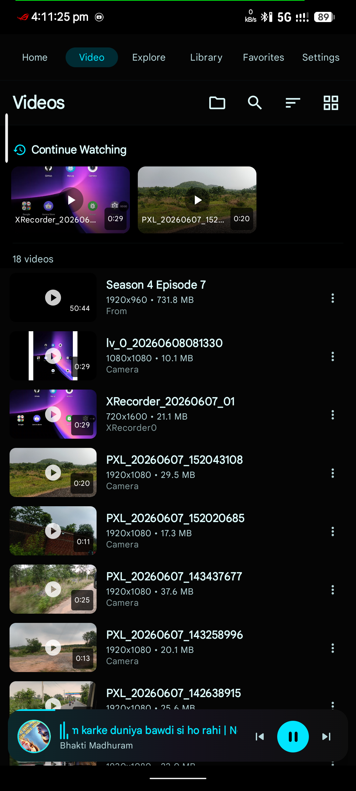
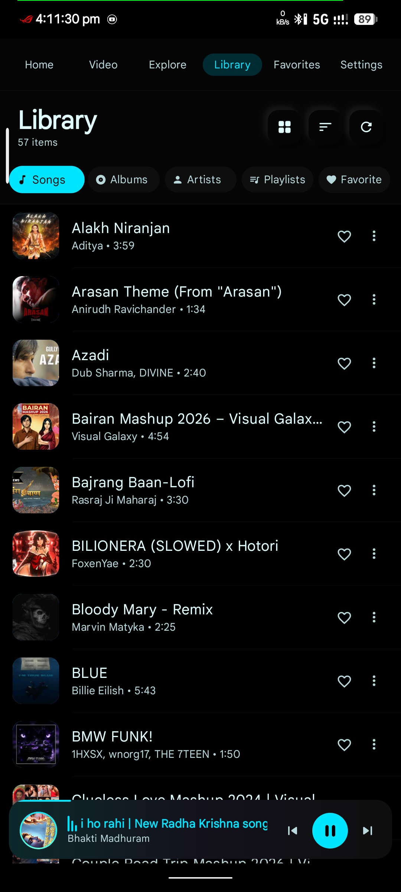
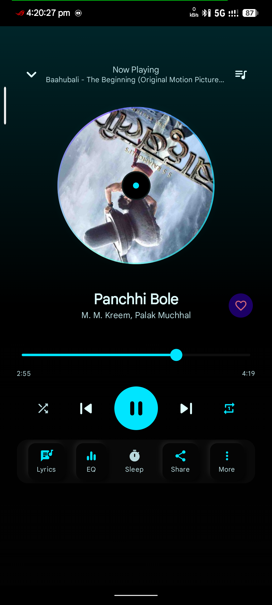
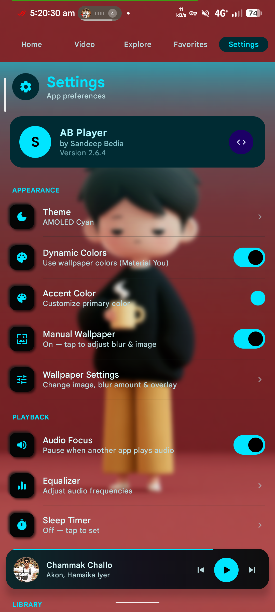

<div align="center">
  
  <h1>AB Player</h1>
  <p><strong>Powerful Offline Music & Video Player for Android</strong></p>
  <p>Built with Jetpack Compose · Material 3 · Neumorphism · ExoPlayer</p>

  <p>
    
    
    
    
    
    
    
  </p>

  <a href="#-features">Features</a> ·
  <a href="#-screenshots">Screenshots</a> ·
  <a href="#-tech-stack">Tech Stack</a> ·
  <a href="#-download">Download</a> ·
  <a href="#-themes">Themes</a> ·
  <a href="#-license">License</a>

  <br><br>

  <a href="https://github.com/Sandeepbedia/AB-Player">
    
  </a>
  <a href="https://github.com/Sandeepbedia">
    
  </a>
</div>

---

## 📱 Features

### 🎵 Music Playback
- Play, pause, next, previous with seek bar
- Repeat modes: **None / One / All**
- **Shuffle** all songs
- Persistent **playback queue** with drag-to-reorder
- **Audio focus** handling (duck/drop)
- **Skip silence** mode
- **Crossfade** between tracks
- **Bass boost** toggle
- **5-band Equalizer** with 11 presets: Normal, Pop, Rock, Jazz, Classical, Dance, Acoustic, Bass Boost, Treble Boost, Vocal, Custom
- **Sleep timer** (5/10/15/30/60 min or custom)

### 🎬 Video Playback
- Dedicated **Videos** tab with grid/list view
- Full-screen ExoPlayer with **Picture-in-Picture (PiP)**
- **Brightness & volume** swipe gestures
- **Lock screen** toggle (disables touch)
- **Orientation lock** / auto-rotate
- Session paused on PiP exit

### 📚 Library Management
- **Songs** — full list with search, sort (Title, Artist, Album, Date Added, Duration)
- **Albums** — 2-column grid, expand to song list
- **Artists** — grouped by artist, expandable
- **Playlists** — create, delete, add/remove songs, clear all
- **Favorites** — ❤️ heart toggle, dedicated tab
- **Folders** — group by parent folder
- **Recently Played** — per-song timestamp tracking

### 🏠 Home Screen
- Welcome greeting header
- **Recently Added** — horizontal scrollable row
- **Most Played** — horizontal scrollable row
- **Continue Listening** — resume from last position
- **Quick Shuffle All** button

### 🔍 Explore & Search
- Genre / artist browsing
- Premium song cards
- **Real-time search** with autocomplete suggestions
- **Search history** (chips, clearable)
- **Trending searches**

### 🎨 Themes & Customization
- **7 theme modes**: System, Light, Dark, AMOLED, AMOLED Cyan, AMOLED Pink, AMOLED Gold
- **8 accent colors**: Purple, Blue, Pink, Cyan, Gold, Green, Orange, Teal
- **Dynamic Color** (Material You) — wallpaper-based palette
- **Neumorphism** design system with per-theme shadows
- **Grid/List** view toggle

### ⚙️ Settings
- Theme & accent color picker
- Equalizer presets
- Audio focus, skip silence, crossfade, bass boost toggles
- Subfolder filtering
- Playback notification toggle
- Default library tab selection
- **Re-scan Music** — force refresh from MediaStore
- **Clear Data** — reset Room DB + preferences
- **Check Updates** — OTA update check via GitHub
- **Changelog History** — full release notes from GitHub

### 🔄 OTA Updates
- Automatic version check on launch
- Manual check in Settings
- Download latest APK directly from GitHub Releases
- Full changelog history screen

---

## 📸 Screenshots

<div align="center">

| Home | Library | Player | Video |
|:----:|:-------:|:------:|:-----:|
|  |  |  |  |

| Equalizer | Settings | Search | Queue |
|:---------:|:--------:|:------:|:-----:|
|  |  |  |  |

</div>

> ⚠️ Screenshots folder not yet added. Run the app or generate screenshots and place them in `screenshots/` directory.

---

## 🏗️ Tech Stack

| Layer | Technology |
|-------|-----------|
| **Language** | Kotlin 100% |
| **UI Framework** | Jetpack Compose + Material 3 |
| **Architecture** | Single Activity, MVVM |
| **DI** | Dagger Hilt |
| **Database** | Room (KSP) |
| **Playback** | Media3 ExoPlayer + MediaSession |
| **Image Loading** | Coil (with VideoFrameDecoder) |
| **Preferences** | DataStore (Preferences) |
| **Navigation** | Navigation Compose |
| **Min/Target SDK** | API 26 / API 36 (Android 16) |
| **Theme Engine** | Custom 7-mode theme + Neumorphism + Dynamic Color |

---

## 🎨 Theme System

| Mode | Description |
|------|-------------|
| `System` | Follows device day/night |
| `Light` | Always light — neumorphism grey base |
| `Dark` | Always dark — deep indigo surfaces |
| `AMOLED` | Pure black `#000000` — saves battery on OLED |
| `AMOLED Cyan` | Pure black + electric cyan accents |
| `AMOLED Pink` | Pure black + vibrant pink accents |
| `AMOLED Gold` | Pure black + warm gold accents |

---

## 📥 Download

Get the latest APK from GitHub Releases:

[](https://github.com/Sandeepbedia/AB-Player/releases/download/v2.6.8/ABPlayer-v2.6.8.apk)

Or check for updates directly from **Settings > Check Updates** inside the app.

---

## 🛠️ Build From Source

1. **Clone the repository**
   ```bash
   git clone https://github.com/Sandeepbedia/AB-Player.git
   ```

2. **Open in Android Studio** (Ladybug or newer recommended)

3. **Sync Gradle** — uses version catalog (`gradle/libs.versions.toml`)

4. **Run**
   ```bash
   ./gradlew installDebug
   ```

   For a release build:
   ```bash
   ./gradlew :app:assembleRelease
   ```

> **Note**: Release builds are signed with a keystore at `app/keystore/mykey.jks`. Replace it with your own for distribution.

---

## 🤝 Connect & Social

<div align="center">

[](https://github.com/Sandeepbedia)
[](https://github.com/Sandeepbedia/AB-Player)
[](https://github.com/Sandeepbedia/AB-Player/releases)

</div>

---

## 📄 License

```
MIT License

Copyright (c) 2026 Sandeepbedia

Permission is hereby granted, free of charge, to any person obtaining a copy
of this software and associated documentation files...
```

---

<div align="center">
  <p>Made with ❤️ by <a href="https://github.com/Sandeepbedia">Sandeepbedia</a></p>
  <p>
    
    
    
  </p>
</div>
